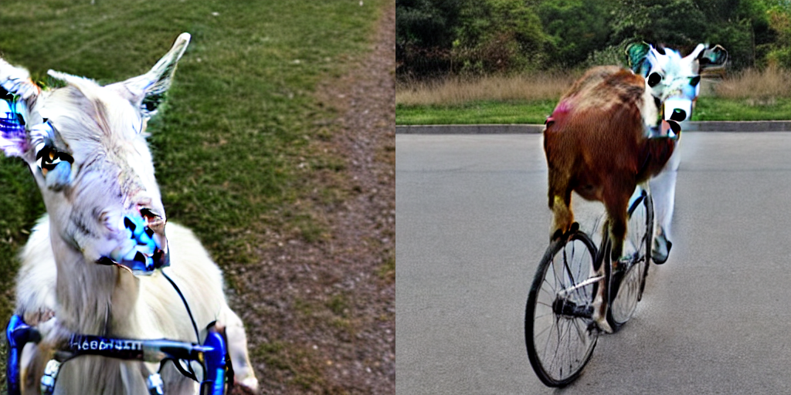

# Generating illustrated lunch break stories
When I teach my primary school class, I always read during the lunch break. 
It's a great way to enjoy a story together, and it provides a bit of chillness in the middle of a hectic day.
In my opinion, the best lunch break stories contain three ingredients.

1. They're funny
2. They're magical 
3. They contain beautiful pictures

Sometimes it's hard to find such an ideal story! So... :) can we generate them using text/image generation?
This is a mini-project, playing around with Huggingface-hosted models.
Based on a prompt, we use GPT2 to generate the rest of the story and a Stable Diffusion model to 
generate an accompanying picture.
Hopefully the magic and fun will then follow automatically....

# How to run

---

Open `notebooks/generate_text_from_prompt.ipynb` to generate the story based on a prompt. Currently the prompt is

 _"The goat was just riding his bicycle through the fields when he saw"_

The resulting text snippets will be saved in `generated_output/*.txt`

---

Open `notebooks/generate_images_from_prompt.ipynb` to generate the pictures accompanying the story. 
Currently, the prompt is

_"a goat on a bicycle"_

The resulting images will be saved in `generated_output/*.png`

# Results
_The cycling goat lunch break story._

1. The images generated by the Stable Diffusion model. They are indeed goats, on things that are somewhat close to bikes. 

Some candidate stories generated by GPT2. 
> _The goat was just riding his bicycle through the fields when he saw ichthyosaurs on the horizon, the tattered carcass of which he'd seen in the film.
"I just thought ichthyosaurs were pretty big!" he admits.
 "I didn't know this was real.
 All I knew was that a lot of them were there.
" He has heard lots of stories of hairy-heeled hippos and crocodiles, but had never been involved in a monster..._

>_The goat was just riding his bicycle through the fields when he saw ixelas standing at the end of a hill.
 He looked up and said, 'what the hell is going to happen to me here?' The goat said, 'I want to be a scientist, not a farmer'.
 He was very nice and he never told anybody that he was a scientist.
 The goat said, 'how do scientists know there are not all the goats?' The goat said, 'well, we know that all the goats come from a land before it has dried and we see them when they come.
 But there are not all the goats coming back and there are still more goats waiting for us...'_

>_The goat was just riding his bicycle through the fields when he saw  the goat's horn.
  He had never seen any goats before so he stopped at the gate to bring him.
  I asked him if he had ever heard a goat tell someone about him being a goat but he was reluctant to answer.
  He told me he had only heard about goat's horns once but now  had heard it twice before.
  We all agreed to follow him until we reached and at that point my friend called to tell me the goat was dead.
I had hoped that he would talk to the goat but he didn't.
  When I called the dead goat, he told me he had the horns_

